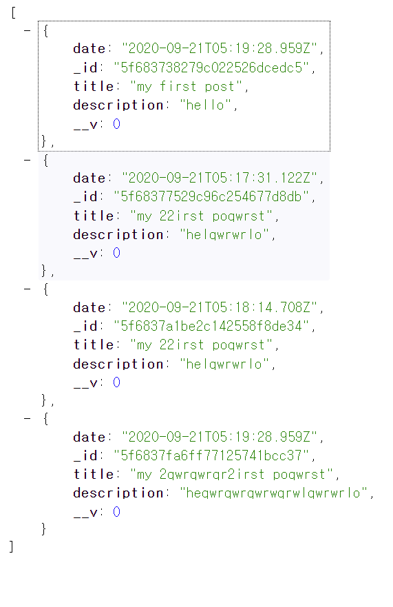

# node-practice

https://www.youtube.com/watch?v=vjf774RKrLc&ab_channel=DevEd

youtube dev ed의 Build A Restful Api With Node.js Express & MongoDB | Rest Api Tutorial 참고

node, mongo, express를 통한 restful api 생성, CRUD 기능 구현

***
  "dependencies": {
  
    "body-parser": "^1.19.0",  // 파일을 JSONFY함
    
    "cors": "^2.8.5",  // CORS 정책 위반시 해결
    
    "dotenv": "^8.2.0", // private한정보 보호
    
    "express": "^4.17.1", // node의 create-react-app
    
    "mongoose": "^5.10.6", // 몽고-노드 확장모듈
    
    "nodemon": "^2.0.4" // 저장할때마다 상태최신화
    
  }
***

node, express, mongo, postman을 이용해 crud를 해보았다.

